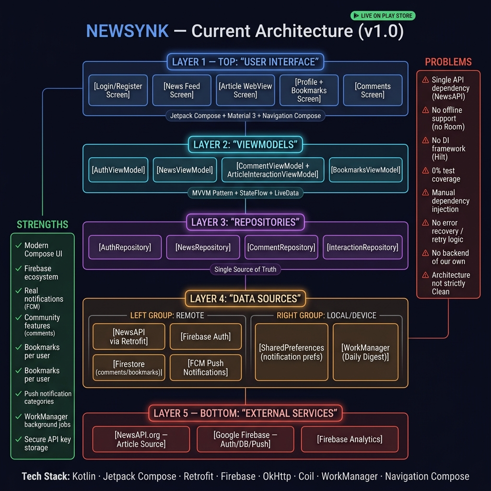

# Newsynk

Newsynk is a native Android news aggregator built with Kotlin and Jetpack Compose. It combines stories from The Guardian, GNews, and Currents, then presents them in a searchable, category-based feed with bookmarking, voting, comments, sharing, and configurable notifications.


## Features

- Aggregated headlines from The Guardian, GNews, and Currents
- Category filters, search, pagination, and pull-to-refresh
- Personalized For You feed, topic onboarding, and recent searches
- Multi-source story clustering with a Compare Coverage view
- Room-backed offline feed cache with offline status indicators
- Native article reader with takeaways, reading progress, font/spacing controls, sepia mode, translation handoff, and text-to-speech
- Source-transparency panels distinguishing reporting from opinion/analysis
- Email/password and Google authentication through Firebase
- Firestore-backed bookmarks, article voting, comments, replies, and comment voting
- Link sharing and generated Newsynk story cards
- Firebase Cloud Messaging for breaking, category, reply, and digest notifications
- Personalized daily briefing with configurable delivery time, notification preferences, and quiet hours
- Comment reporting, user blocking, posting cooldowns, and input limits
- User profiles, custom avatars, saved articles, and dark mode
- Four-tab Home, Explore, Saved, and Profile navigation

## Screenshots and artwork

| Architecture | Square artwork |
| --- | --- |
|  |  |

Additional vertical artwork is available in [`docs/screenshots`](docs/screenshots).

## Technology

- Kotlin and Jetpack Compose
- Material 3 and Navigation Compose
- MVVM with StateFlow
- Hilt and KSP
- Retrofit, OkHttp, and Gson
- Firebase Authentication, Firestore, Analytics, and Cloud Messaging
- Firebase App Check, Crashlytics, and Performance Monitoring
- Room offline cache
- WorkManager
- Coil

## Requirements

- Android Studio with JDK 17
- Android SDK 36
- Minimum supported Android version: Android 7.0 (API 24)
- A Firebase Android app using package `com.abpvt.newsapp` for authentication and social features
- API keys for the news providers you want to enable

## Setup

1. Clone the repository:

   ```bash
   git clone https://github.com/not-a-hack-er/Newsynk.git
   cd Newsynk
   ```

2. Copy `local.properties.example` to `local.properties`. For local debug builds you can use direct provider keys:

   ```properties
   sdk.dir=/path/to/Android/Sdk
   NEWS_API_KEY=your_guardian_key
   GNEWS_API_KEY=your_gnews_key
   CURRENTS_API_KEY=your_currents_key
   GOOGLE_WEB_CLIENT_ID=your_google_web_client_id
   ```

   Guardian falls back to its public `test` key when `NEWS_API_KEY` is blank. GNews and Currents require their own keys.

   Production release builds deliberately exclude all three provider keys. Configure the secure backend URL instead:

   ```properties
   NEWSYNK_BACKEND_URL=https://your-region-your-project.cloudfunctions.net/api/
   ```

3. Download `google-services.json` from Firebase Console and place it in the repository root. The file is deliberately ignored by Git.

4. Enable Email/Password and Google providers in Firebase Authentication. Create Firestore, review [`firestore.rules`](firestore.rules), and deploy the included rules and indexes:

   ```bash
   firebase deploy --only firestore:rules,firestore:indexes
   ```

5. For production news delivery, configure and deploy the Firebase Functions proxy. Provider keys are stored as Firebase secrets and never compiled into the release APK:

   ```bash
   firebase functions:secrets:set GUARDIAN_API_KEY
   firebase functions:secrets:set GNEWS_API_KEY
   firebase functions:secrets:set CURRENTS_API_KEY
   cd backend && npm install && npm run build && cd ..
   firebase deploy --only functions
   ```

   Register both debug and release builds with Firebase App Check. Debug builds use the debug provider; release builds use Play Integrity. The deployed proxy rejects requests without a valid App Check token.

6. Build and test from the repository root:

   ```bash
   ./gradlew testDebugUnitTest assembleDebug
   ```

   On Windows, use `gradlew.bat`.

The project can compile without Firebase configuration for CI and source validation, but Firebase-dependent features require a valid `google-services.json` at runtime.

## Verification

Run the local verification suite with:

```bash
./gradlew testDebugUnitTest lintDebug assembleDebug assembleDebugAndroidTest :benchmark:assembleBenchmarkRelease
cd backend
npm ci
npm audit --omit=dev
npm run build
npm run test:rules
```

Generating an actual Baseline Profile or collecting macrobenchmark measurements requires an API 33+ emulator or physical device. Run `./gradlew generateBaselineProfile` after connecting one.

## Release signing

Keep the keystore outside the repository. Add these values only to your untracked `local.properties`:

```properties
RELEASE_STORE_FILE=/absolute/path/to/newsynk-release.jks
RELEASE_STORE_PASSWORD=your_store_password
RELEASE_KEY_ALIAS=your_key_alias
RELEASE_KEY_PASSWORD=your_key_password
```

Then build with:

```bash
./gradlew clean testReleaseUnitTest assembleRelease
```

## Continuous integration and releases

The CI workflow runs unit tests, builds the debug APK, and uploads it as a workflow artifact on pushes and pull requests.

Pushing a tag such as `v2.0.0` runs the release workflow. Configure these GitHub Actions secrets first:

- `GOOGLE_SERVICES_JSON_BASE64`
- `NEWSYNK_BACKEND_URL`
- `GOOGLE_WEB_CLIENT_ID`
- `RELEASE_KEYSTORE_BASE64`
- `RELEASE_STORE_PASSWORD`
- `RELEASE_KEY_ALIAS`
- `RELEASE_KEY_PASSWORD`

The workflow builds a signed release APK, uploads it as an Actions artifact, and creates a GitHub Release for the tag.

## Security

- Never commit `local.properties`, `google-services.json`, keystores, or signing passwords.
- Release APKs contain no Guardian, GNews, or Currents credentials; the Firebase Functions proxy owns them as server-side secrets.
- Restrict news-provider keys to the APIs and quotas the app requires.
- In Google Cloud Console, restrict the Firebase browser/API key to this Android application using package `com.abpvt.newsapp` and the release/debug SHA certificate fingerprints where supported.
- Rotate any credential that was previously exposed publicly and review Firebase Authentication and Firestore activity.

See [SECURITY.md](SECURITY.md) and the [Firebase security review](docs/FIREBASE_SECURITY_REVIEW.md) for reporting, access-control, and credential-hardening guidance.

## License

Newsynk is licensed under the [MIT License](LICENSE).
